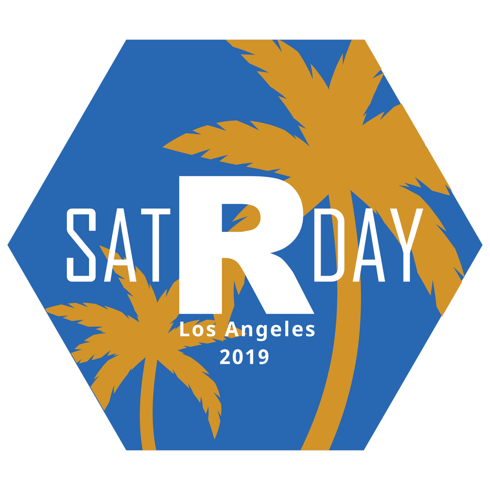

```{r setup, include=FALSE}
knitr::opts_chunk$set(echo = FALSE)
options(knitr.kable.NA = "--")
```

```{r, warning=FALSE, echo=FALSE}
source(here::here("R", "packages.R"))
source(here::here("R", "functions.R"))

laocrugs <- read_csv(here::here("data", "laocrugs.csv"))
events <- read_rds(here::here("data", "events.rds"))
past_events <- read_rds(here::here("data", "past_events.rds"))
```

We are an alliance of R users groups in Southern California. No single group can serve this sprawling area, and so we have joined forces to centralize all R group events and information in one place. We currently include `r glue::glue_collapse(laocrugs$group_name, sep = ", ", last = ", and ")`.

<div class="headers">
<h1>Upcoming Events</h1>
</div>

```{r}
# `r clean_events(events) %>% pmap(as_card) %>% map(cat)`
cards <- clean_events(events) %>% 
  pmap(as_card)
```

`r tagList(cards)`

<div class="headers">
<h1>Join us on Slack</h1>
</div>

Our R groups recently merged Slack spaces. Keep up with events, ask for help with R, and get to know your local R community: [Sign up today and join a network of R Users in Southern California](https://socalrug.herokuapp.com/).

<div class="headers">
<h1>SatRDay LA 2019</h1>
</div>

The first SatRday in Southern California Los Angeles was held on April 6th, 2019 at UCLA! satRday LA was a huge success: tickets sold out and over 180 R users attended. If you missed it, you can <a href = 'https://www.youtube.com/playlist?list=PLQRHxIa9tfRvXYyaVS77zshvD0i17Y60s'>watch the recorded talks on YouTube</a> or <a href = 'https://github.com/satRdays/losangeles/tree/master/2019'>check out the slides on GitHub</a>. For other event details and announcements, please visit <a href = 'https://losangeles2019.satrdays.org'>https://losangeles2019.satrdays.org</a>. 
We look forward to seeing you next year at satRday LA 2020!

<!-- For future use: A submission request -->
<!-- satRday Los Angeles 2019 is now accepting submissions for session talks, lightning talks, and posters! The deadline is Feb 10, 2018. Submit today at <a href = 'https://sessionize.com/satrday-la-2019'>sessionize</a>. -->
<!-- For future use: an event card for satRday -->
<!-- `r as_card("A conference for users of the R Language", "satRday Los Angeles 2019", "April 6, 2019 @ UCLA James West Alumni Center", "https://losangeles2019.satrdays.org/")` -->

<div class="headers">
<h1>Organizations</h1>
</div>

```{r, echo = FALSE, layout="l-body-outset"}
fa_rows <- laocrugs %>%
  select(group_name, website, email, meetup_page, twitter, github, slack) %>% 
  pmap(fa_row)
```

<div class="card">
<div class="container container-buffer">
<table class="tab" cellspacing="0" cellpadding="0">
`r tagList(fa_rows)`
</table> 
</div>
</div>
<br>

```{r, layout="l-screen-inset"}
register_google(Sys.getenv("GOOGLE_MAPS_KEY"))
addresses <- geocode(laocrugs$address)

icons <- awesomeIcons(
  icon = 'ios-stats',
  iconColor = 'black',
  library = 'ion'
)

bind_cols(laocrugs, addresses) %>% 
  filter(group_name != "Los Angeles West R Users") %>% 
  mutate(group_name = ifelse(group_name == "Data Science LA", "Data Science LA/LA West R Users Group", group_name)) %>% 
  leaflet() %>%
  addProviderTiles(providers$CartoDB.Positron) %>% 
  addAwesomeMarkers(~lon, ~lat, popup = ~group_name, icon = icons)
  # doesn't work right now: addMarkers(~lon, ~lat, popup = ~group_name, icon = icons("https://www.r-project.org/logo/Rlogo.png", iconWidth = 25, iconHeight = 19))
```


